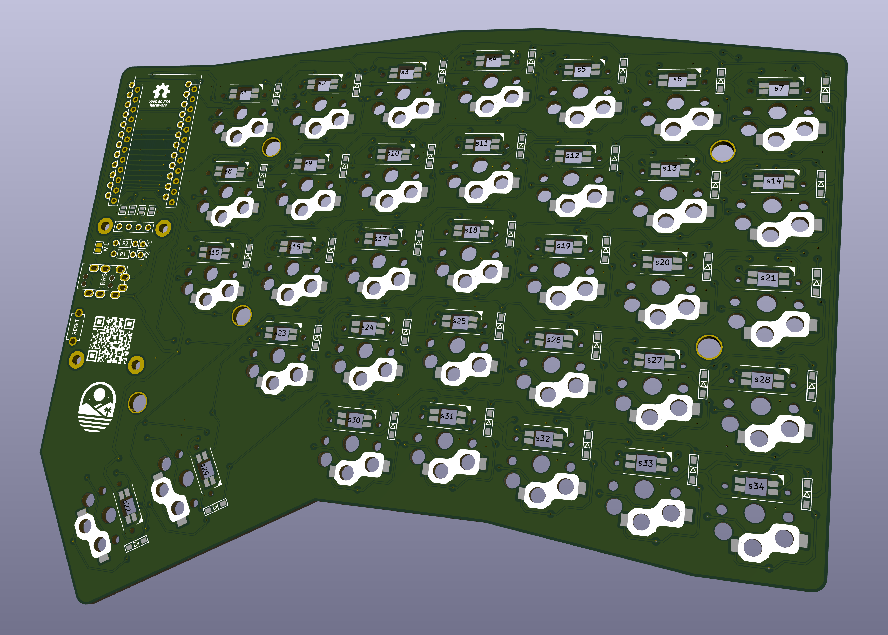

# BigNomad Keyboard

The Nomad is a 9×5 keys, column-staggered split keyboard based largely on the [Nomad Keyboard](https://github.com/fiendie/NomadKeyboard), which is based on the [Sofle Choc by Brian Low](https://github.com/brianlow/SofleKeyboard).
It uses low profile Kailh Choc v1 switches with hotswap sockets and features per-key RGB lighting via SK6812 Mini-E LEDs.
Compared to the Nomad Keyboard the BigNomad offers an additional numpad as inner columns, an extra thumb cluster key, and an additional modifier key in the 5th row.
To make the keyboard more compact, support for OLED or pro micro based mcus are dropped. Instead, the mcu must be a RP2040 mini. Added support for a rotary encoder on top of the mcu footprint as well.

## RGB setup
I wanted to be able to control all leds individually on both hands, which is not possible when synching state through a serial connection. So I connected the last led to the trrs jack. All leds can then be chained in one long chain and all leds can be individually addressed. If you don't want this behaviour, choose jumper mcu on both halves. 

One caveat with using a trrs jack this way is that the serial connection is limited to half duplex serial. No full duplex or i2c possible. But since its not neccesary to sync the led state to the slave, the half duplex serial is fast enough.

## Bill of materials
- 2x RP2040 mini
- 6x female round header socket, the low profile ones that accept diode legs. They are break-apart into correct length, you need at least 46 pins.
- 2x EC11 rotary encoder
- 2x TRRS jack
- 1x TRRS cable
- 1x USB cable (pro tip; use the magnetic ones with data lines)
- 82x DIN123 diodes
- 82x SK6812 mini RGB leds
- 82x Kailh Choc hotswap sockets
- 82x Kailh Choc switches of your choice

## Build instructions
1. For the left hand side; Solder jumper J_RGB labeled mcu and keep trrs clear of any solder.
2. For the right hand side; choose whether you want to control the leds from the slave mcu or from the trrs plug. Solder the jumper mcu OR trrs. 
3. Solder diodes, keep an eye on the direction printed on the silk sheet.
4. Solder hotswap sockets
5. Solder RGBs
6. Solder encoder on the front side of the pcb.
7. Solder hotswap socket for mcu on the back side of the pcb. 
8. Solder pins on mcu
9. Place mcu, keep in mind the pin labeled as vcc!
10. Flash mcu and check workings of the RGB
11. Place a switch in a socket and test the matrix
12. Build the right hand side and test everything
13. Connect the two halves with a trrs cable and test the complete matrix. 

## Firmware 

Nomad uses [QMK firmware](https://qmk.fm/)

## Default layout 

TODO

## Images
These are still the original Nomad images, BigNomad images are pending..

